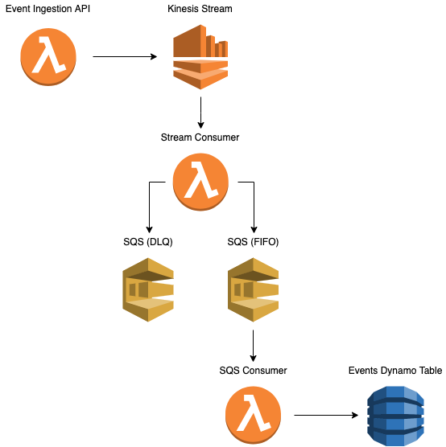

# Data streaming with AWS Kinesis

Many applications require the need for realtime data processing.

There are many tools to solve this problem, including Kafka, AWS SQS, RabbitMQ, etc...

In this example, we will be using Kinesis as our data streaming service.

### Overview



A few things are happening here.

1. This service exposes an HTTP interface for pushing events to Kinesis.
2. HTTP PUT `/stream` will do a `putRecord` to Kinesis.
3. A lambda is executed for each event on the stream. This lambda will write to SQS.
4. If the lambda fails to write to SQS 3 times (due to SQS throttling issues or something...), event message is driven to another SQS queue which acts as a DLQ.
5. On successful SQS put, a lambda is executed which writes the event payload to Dynamo.
    * We are doing this because we have `on-demand` scaling model on our Dynamo table. If we knew what our event load would look like, we could provision capacity and skip this step, but Dynamo can take time to scale on-demand which can throttle writes + throw errors. The queue here helps us relieve pressure on the system.

## Why Kinesis?

### Kinesis vs SQS
- Kinesis offers multiple consumers for a single stream. SQS only allows one consumer at a time.
- Kinesis is built for scalable real-time data processing. While SQS *can* solve this problem -- depending on how much throughput your application gets -- the SQS consumer limitations might be a bottleneck.
- Kinesis allows 'playbacks' of stream data. You can modify the retention period of your stream data to allow point-in-time playbacks.

### Kinesis vs MSK (Kafka)
- Kinesis is a fully managed service that allows 'connections' to other AWS services like Lambda, EC2, Kinesis Analytics, EMR, Firehose etc. This *can* be a major convenience when building distributed, multi-region / multi-AZ stream architecture.
- Kinesis replicates data across 3 availability zones by default. This means if one AZ goes down, data is made available to 2 other AZ's.
- Kinesis has "at-least-once" delivery for messages. This means, in the event a system fails or a network issue occurs, a message producer may continue to retry a message until it receives a successful acknowledgement (depending on your app, this may not be a pro, since consumers must handle potential duplicate messages.).
- Kinesis has auto-scaling capabilities while MSK requires cluster sizing experience. Identifying the right cluster size is an iterative process and requires cluster management expertise.

## Continued Research
1. Pricing. You can use the Kinesis pricing calculator [here](https://aws.amazon.com/kinesis/data-streams/pricing/).
2. Multi-region replication. I don't know too much about it, but can be done with added infrastructure like Lambda. [Read more](https://engineering.opsgenie.com/cross-region-replication-of-kinesis-streams-4a62f3bb269d).
3. To avoid read throughput bottlenecks, consider [fan out architecture](https://www.linkedin.com/pulse/how-fan-out-amazon-kinesis-streams-alex-casalboni/).

## Kinesis Service Limits

You can read AWS service limits for Kinesis [here](https://docs.aws.amazon.com/streams/latest/dev/service-sizes-and-limits.html).

# Project

This service exposes an HTTP interface for ingesting events. In this demo, there is one default transport of type `stream`. This stream adapter using `Kinesis` under the hood. This can easily be swapped out for a different data stream service.

## Testing locally

To start the ingestion service, run:

```bash
# Install dependencies
npm i

# Start serverless offline
npm start
```

Above command will start serverless offline.

## Writing to stream

```bash
curl -v \
-d '{"stream": "default", "payload": { "energy_type": "nuclear" }}' \
-H 'Content-Type: application/json' \
-H "x-api-key: d41d8cd98f00b204e9800998ecf8427e" \
-e localhost \
-X PUT 'http://localhost:3000/prod/stream'
```

The `x-api-key` is required. The value for this (locally) is `d41d8cd98f00b204e9800998ecf8427e`.
